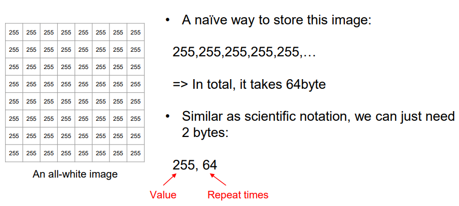
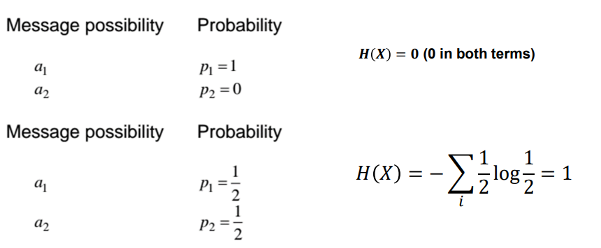
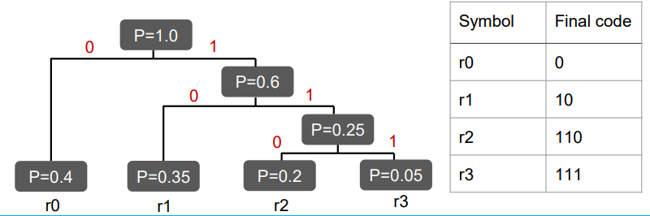
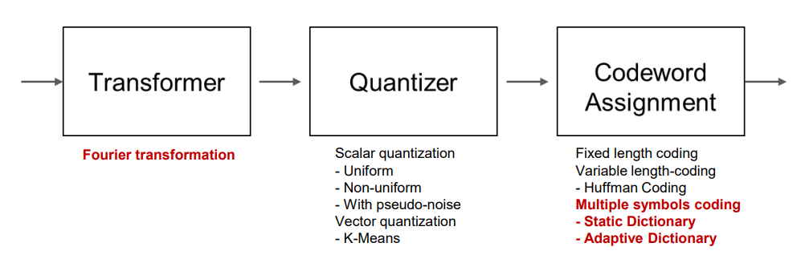
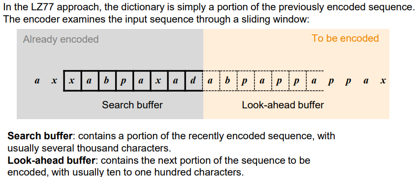
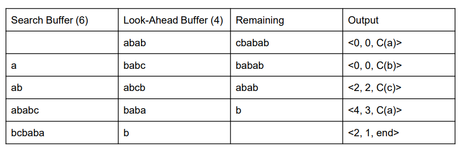
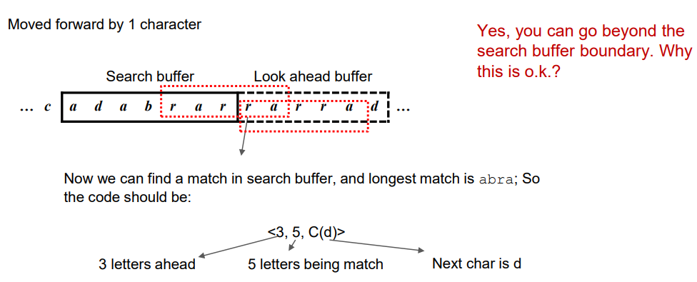
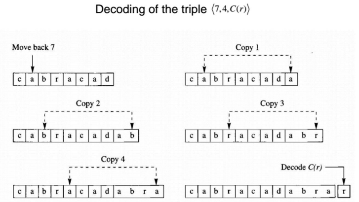

# Encoding

## RLE 

All-white image of size $8\times 8$: `255,64`



## Huffman Encoding
* eg: 3-bits, $2^3=8$ levels of quantization
* Use shorter code for frequently used phrase
* **Symbol-by-Symbol Encoding**.
* **Prefix Code**: 
  * With variable code length, any code must not be prefix of another for the code to be uniquely decodable.
  * Requirement: Note the equivalence between prefix code and prefix tree.
* **Entropy**:
  * $H(X)=-\sum_i{P(x_i)\log_b{P(x_i)}}$
  * 
  * No information: $H(X)=0$, since the message is certainty, any message would carry no information.
  * Maximum information: $H(x)=1$, representation space is uniformly-distributed, hence a message is most informative.
* Relation with average bit rate:
  * Entropy is the **theoretical lower bound** for the possible average bit rate required to code a message.
  * [Shannon's Source Coding Theorem](https://en.wikipedia.org/wiki/Shannon%27s_source_coding_theorem)
* Reconstruction of Huffman Tree
  * Assign list of characters $\sigma\in\Sigma$  associated with probability $p(\sigma)$.
  * Repeatedly join the two nodes $\sigma_1$ and $\sigma_2$ with the lowest probability from the remaining nodes, and let the new node have the probability $p(\sigma_{12})=p(\sigma_1)+p(\sigma_2)$.
  * Traverse the tree by assigning 0 to one of the branches and 1 to another.
    * 
  * Converges to theoretical limit when codebook size increases.

## Multi-Symbol Coding
### Static Dictionary
* Limitations: Dictionary has to be transmitted.
### Dynamic Dictionary
* Widely used in GIF and text-compression.
* New phrases are added to dictionary.
* 
#### LZ77

* Fixed-buffer-size Dictionary-less Scheme
* Elements:
  * Search Buffer
  * Look-ahead Buffer

Scheme:
* `<offset, length-of-match, symbol-following>`
* Encoding:
  * 
  * Note: can go over the search buffer boundary.
  * 
* Decoding:
  * 

##### Encoding
* Buffer Size: 4
```
ababcbabab
> 0 0 a | a
a babcbabab
> 0 0 b | b
ab abcbabab
# 2 steps ahead (counting backwards from pos 0 of lookahead)
> 2 2 c | abc     
ababc babab
> 4 3 a | baba
ababcbaba b
> 2 1 END | b
ababcbabab
```

##### Decoding
```
(0,0,a) (0,0,b) (2,2,c) (4,3,a) (2,1,END)
>  a
> a b
> ab abc
> ababc baba
> ababcbaba b
```

#### LZ78
Scheme:
* `<index-in-dict, symbol-following>`

##### Encoding
* Dictionary entries added in each step is also the dictionary itself.
* Fresh-empty dictionary initialized.
* Dictionary is generated on-the-fly.
* No dictionary would be sent.
```
wabbacwabbacwabbacwabbacwoocwoocwoo
> i: last_id, new_entry (collected item)
> 1: 0 w = w    # 0 implies EMPTY
> 2: 0 a = a
> 3: 0 b = b
> 4: 3 a = ba
> 5: 0 c = c
> 6: 1 a = wa
> 7: 3 b = bb
> 8: 2 c = ac
> 9: 6 b = wab
> 10: 4 c = bac
> 11: 9 b = wabb
> 12: 8 w = acw
> 13: 0 o = o
> 14: 13 c = oc
> 15: 1 o = wo
> 16: 14 w = ocw
> 17: 13 o = oo

wabbacwabbacwabbacwabbacwoocwoocwoo
```

#### LZW
* Dictionary with base character list is used (eg 1-26 for A-Z).
```
EXAMPLE:

predefined set of dictionary:
0 A
1 T
2 G
3 C

input: ATGATCATGAG

generated:
out     next    i   record
0 (A)   T       4   AT
1 (T)   G       5   TG
2 (G)   A       6   GA
4 (AT)  C       7   ATC
3 (C)   A       8   CA
4 (AT)  G       9   ATG
6 (GA)  G       10  GAG
2 (G)   #       11  G#
```

### Applications

* PNG: LZ77 (for lossless ver)
* GIF: LZW