# Transformer

## Color Space
* RGB, XYZ, CIE, YUV color spaces

## Transformer

* Note: Infomation is uniformly discarded at quantization typically...
* Idea: Can we be more efficient by transforming to a set of transform coefficients?
  * Small number of transform coefficients should carry most signal
  * So that more aggressive quantization can be applied to the rest

### Discrete Fourier Transform (DFT)

* 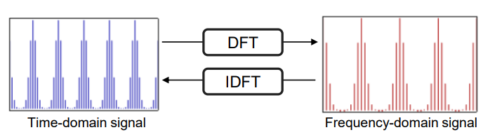
* Time-domain -> Frequency-domain
* 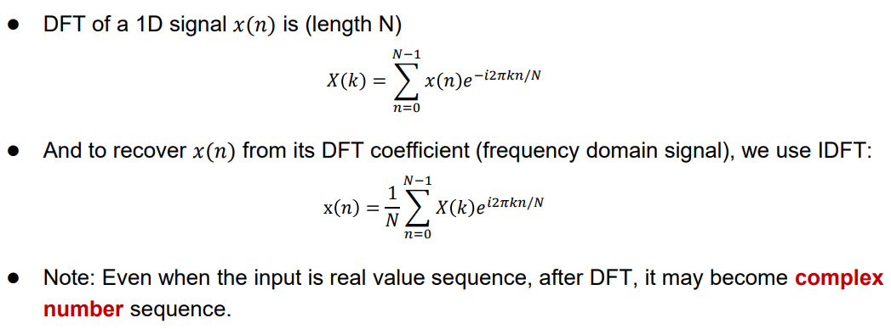
* DFT decomposition:
  * 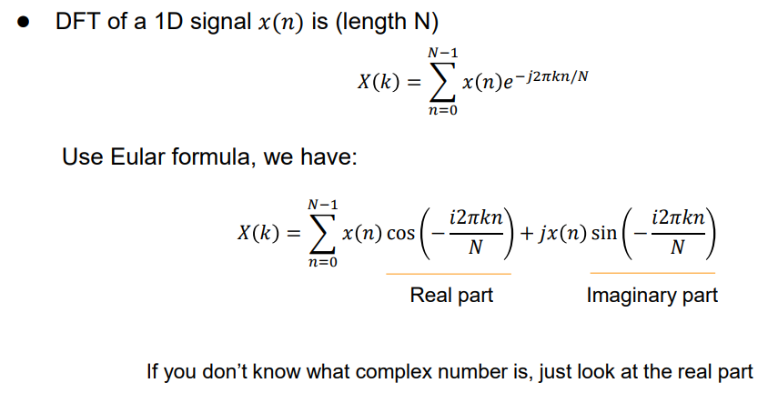
  * 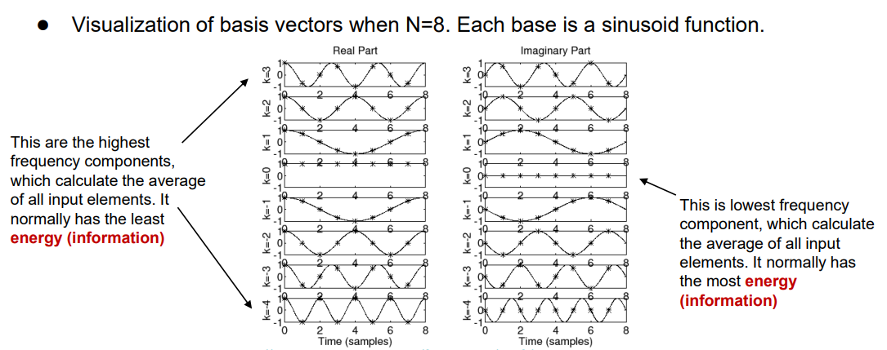
  * 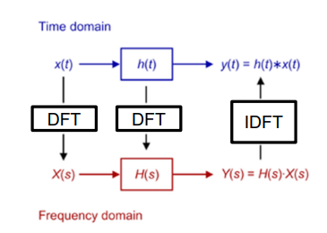
* 2D-DFT:
  * 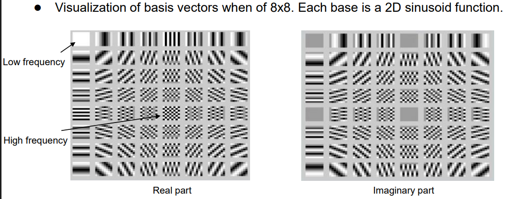
  * 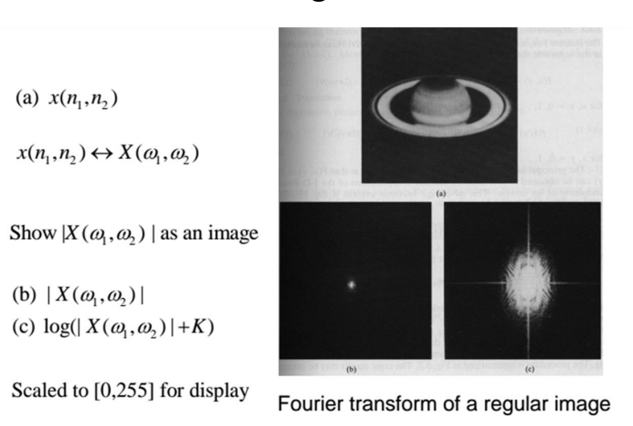
* Problem: 
  * Output is complex-valued (requires double space to store)
  * Output is symmetric (not good for compression)

### Discrete Cosine Transform (DCT)

* 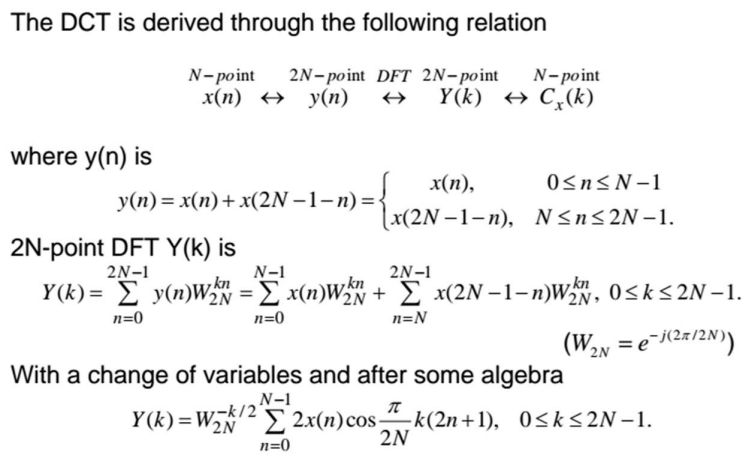
* Idea:
  * $\tilde{x}(n)$ often discountinuous
  * -> Create periodic signal $\tilde{y}(n)$ of period $2N$ and $\tilde{y}(2N-n)=\tilde{x}(n)$
  * -> Transform with DFT
  * DCT transform:
    * 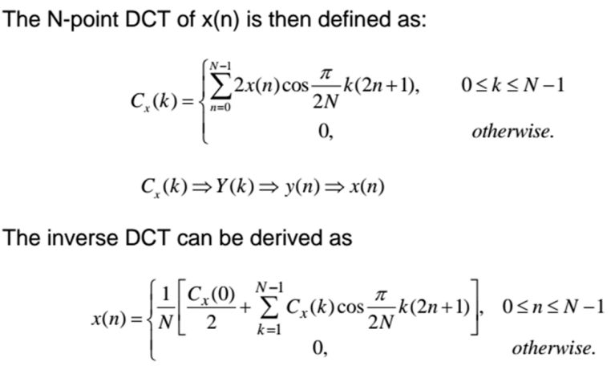
* 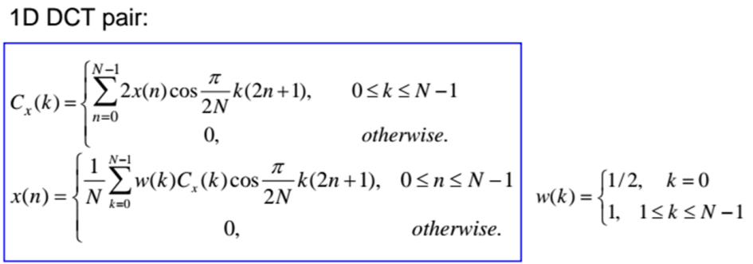
* 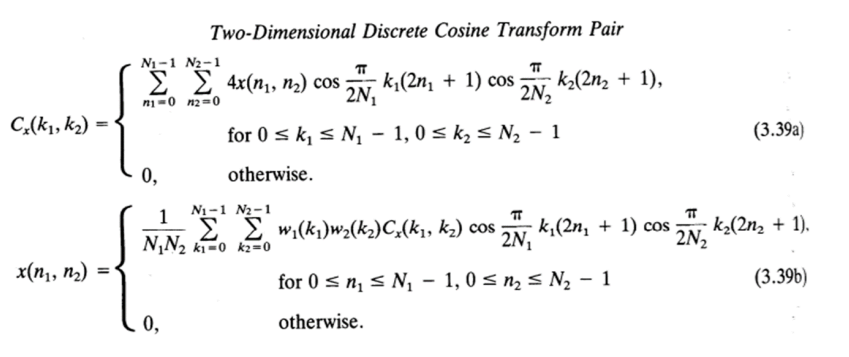
* DFT vs DCT:
  * 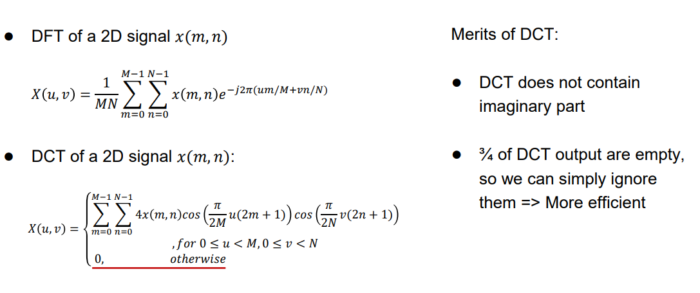
  * 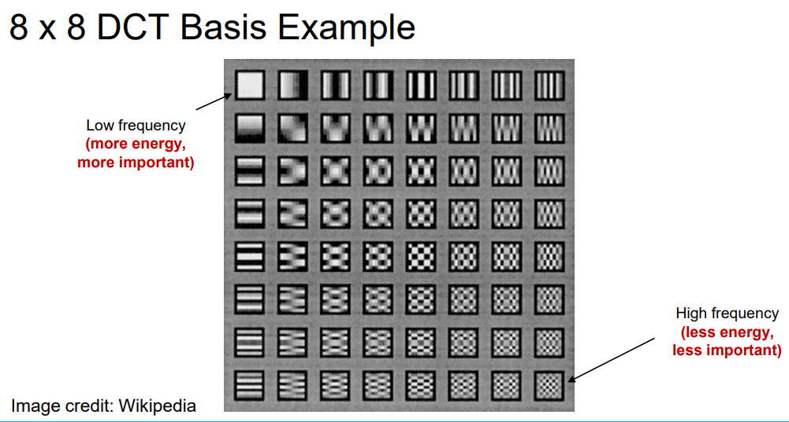
* Results:
  * 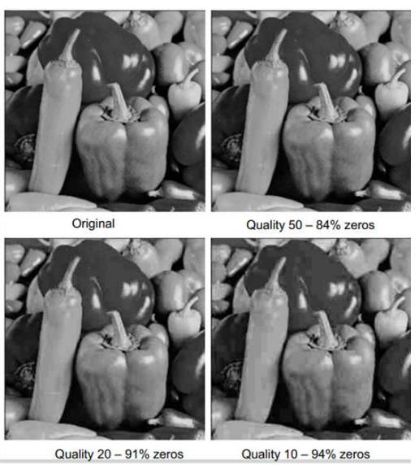
  * Frequency space:
    * 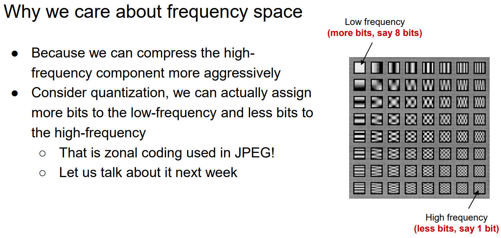
    * We can safely quantize and/or discard the high-freq components.
* Components:
  * Shape: 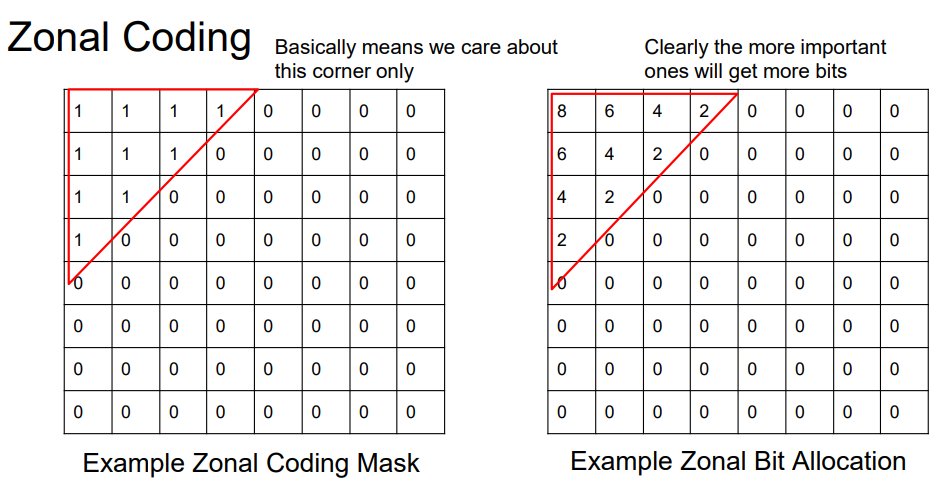
  * Quantization
  * Zig-Zag RLE
    * 

## Application

* JPEG: DCT
  * 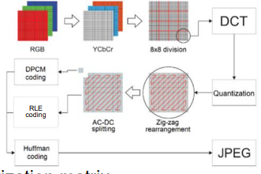