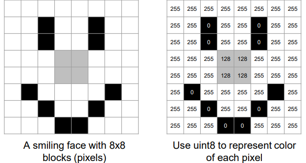
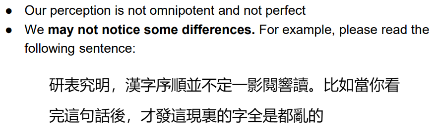
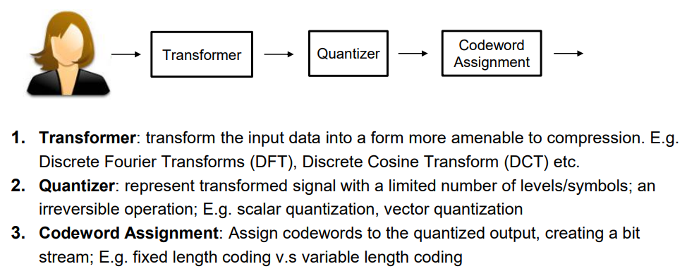
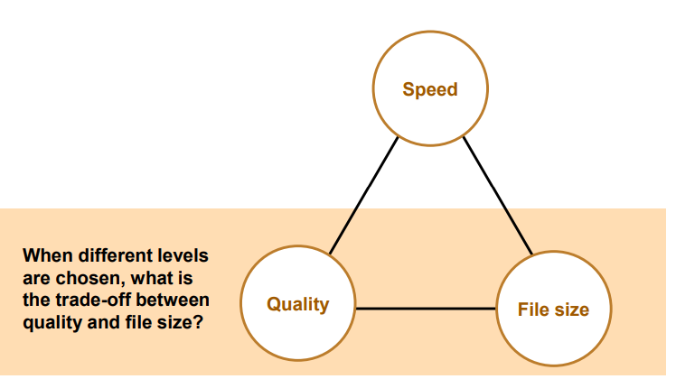
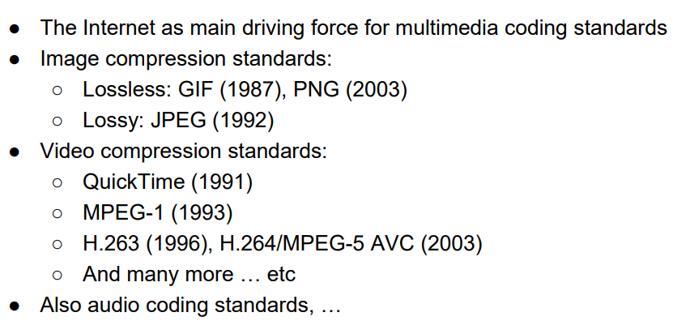
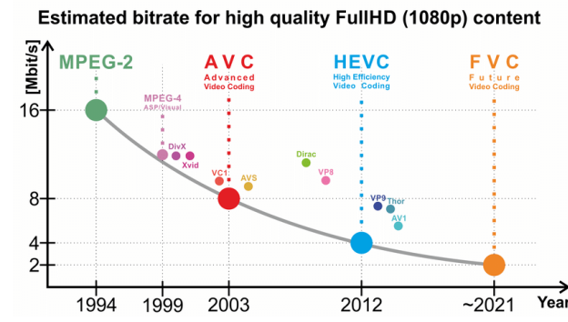

# Compression Schemes

## Image Storing and File Sizes

### Images

Consider an image of size $W\times H$ with $C$ color channels, with $L$ bits storing the scale per channel, the uncompressed file size is:

$$W\times H\times C\times (L/8)$$

### Video

Consider a video of size $W\times H$ with $C$ channels, 8 bit per pixel, duration of $L$ seconds, and a frame-rate of $F$ fps, then the uncompressed file size is:

$$W\times H\times C\times L\times F$$

## Compression Schemes

Types:
* Lossless
* Lossy

Reducing bitstream:
* Redundancy
  * Statistical (Spatial and Temporal)
  * Semantic
  * Psychovisual (we may not notice some differences)
    * 
    * 

### Steps

### Trade-off

### Multimedia Coding Standards

