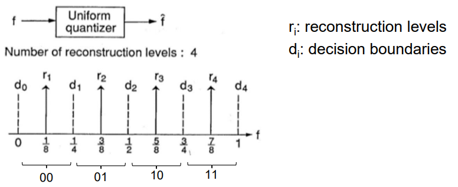
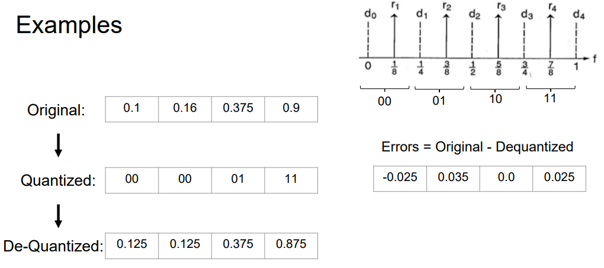
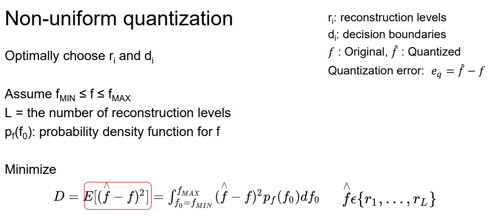
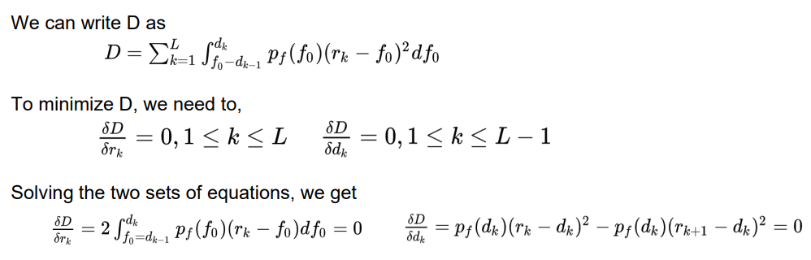
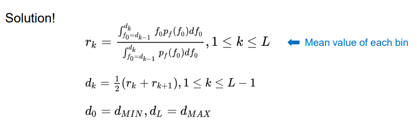
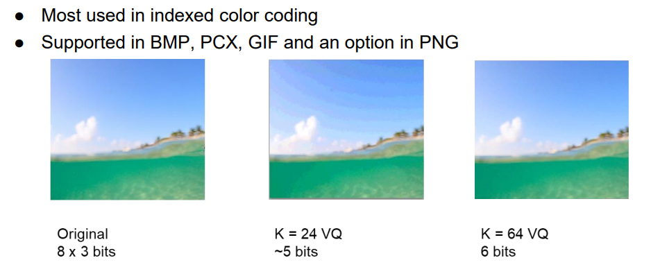

# Quantization

## Scalar Quantization

### Uniform Quantization
* Note: Reconstruction in the range $[L,H]$ will NOT result in actual reconstruction min $L$ and max $H$.
  * 
  * 
* Reconstruction levels $r_i$ and decision boundaries $d_i$.
* Bits and levels:
  * $N$-bit resolution
  * $2^N$ levels of reconstruction
* Quantization error $e_q = \hat{f}-f$

### Non-Uniform Quantization
* Optimally choose $r_i$ and $d_i$.
  * 
* Extended reading
  * 
  * 
* Choice of $p_f$: 
  * Uniform
  * Gaussian

## Vector Quantization

### Color Table
Reduces from $C\times L$ bits ($C$ channels and $L$ bits per channel) to $\hat{L}$ bits for vector quantization.

* **Codebook/Dictionary**: Set of reconstruction levels
* **Cell**: Decision boundary
* Reconstruction levels: the centroid.
* Means of reconstruction:
  * K-means (recursively update centers until no shift in centers)
    * https://shabal.in/visuals/kmeans/3.html
    * No worst-case guarantee
    * K-means++ bound: $\mathbb{E}[\phi]\leq 8(\ln k+2)\phi_\text{OPT}$
    * Needs only $\log_2{K}$ bits per pixel for codebook of size $K$.
    * Usage:
      * 