# Transformer

## Color Space
* RGB, XYZ, CIE, YUV color spaces

## Transformer

* Note: Infomation is uniformly discarded at quantization typically...
* Idea: Can we be more efficient by transforming to a set of transform coefficients?
  * Small number of transform coefficients should carry most signal
  * So that more aggressive quantization can be applied to the rest

### Discrete Fourier Transform (DFT)

* $k\in[-N/2,N/2)$, eg when $N=8$, $k\in[-4,3)$.
* 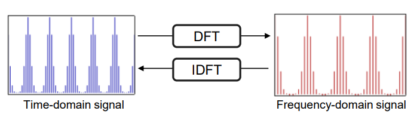
* Time-domain -> Frequency-domain
* 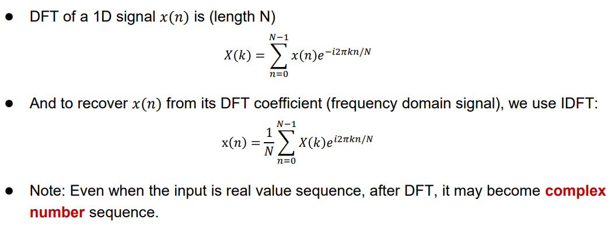
* DFT decomposition:
  * 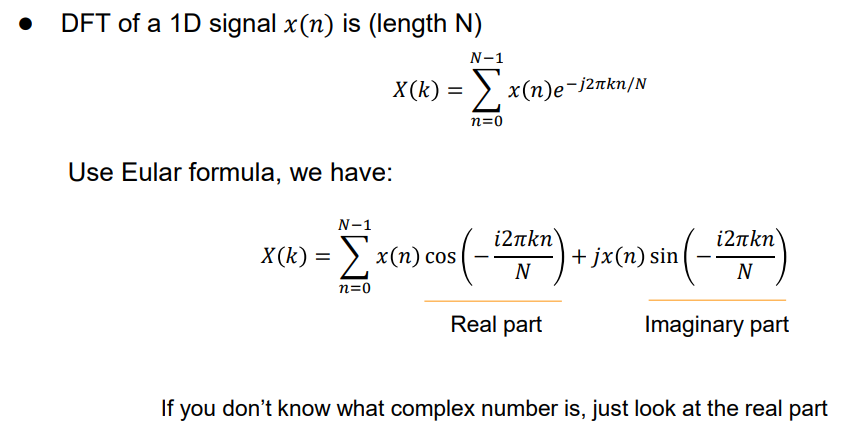
  * 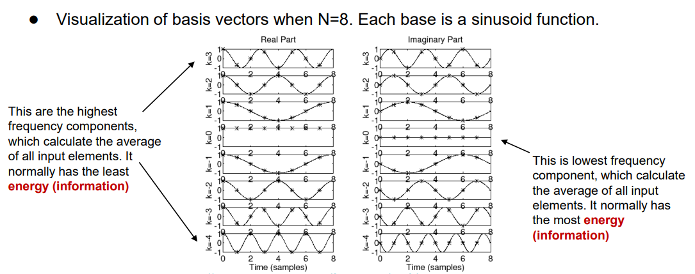
  * 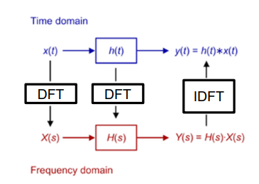
* 2D-DFT:
  * 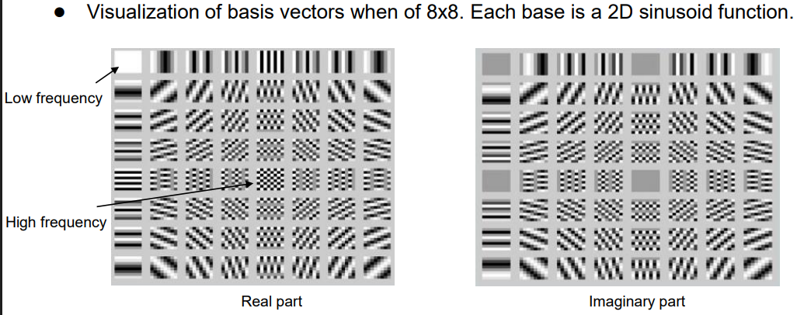
  * 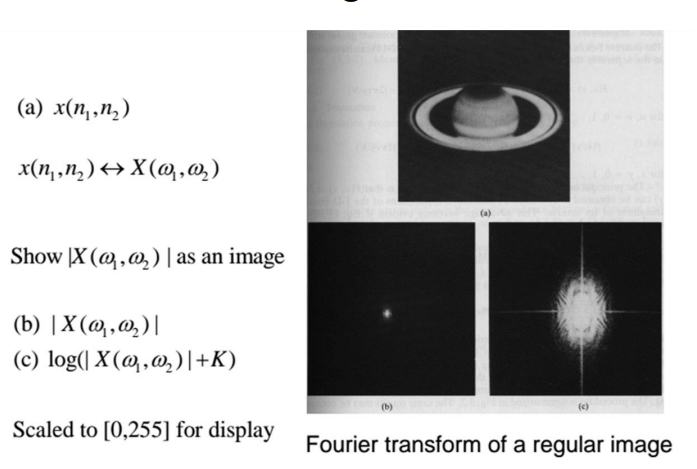
* Problem: 
  * Output is complex-valued (requires double space to store)
  * Output is symmetric (not good for compression)

### Discrete Cosine Transform (DCT)

* 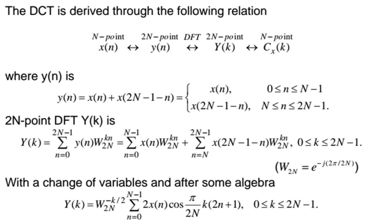
* Idea:
  * $\tilde{x}(n)$ often discountinuous
  * -> Create periodic signal $\tilde{y}(n)$ of period $2N$ and $\tilde{y}(2N-n)=\tilde{x}(n)$
  * -> Transform with DFT
    * Observe that the component is pure and only lie in one direction for same $k$.
  * DCT transform:
    * 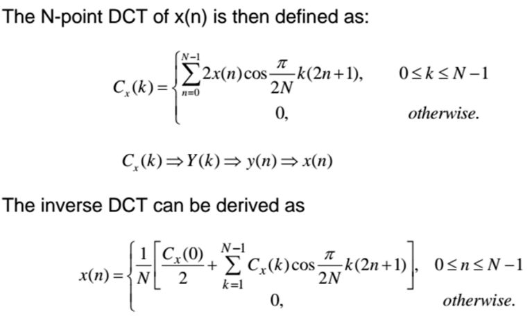
* 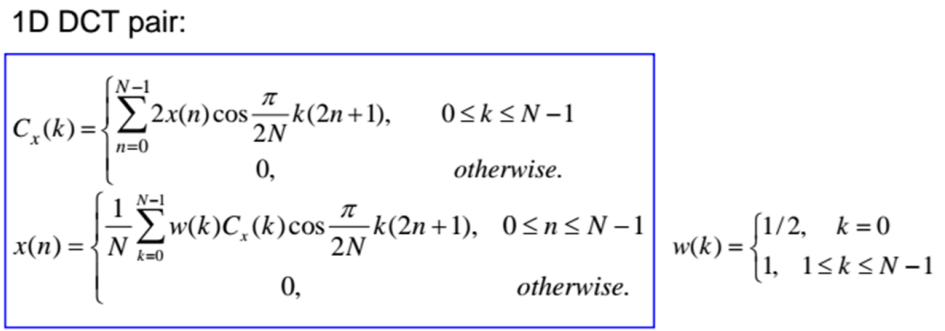
* 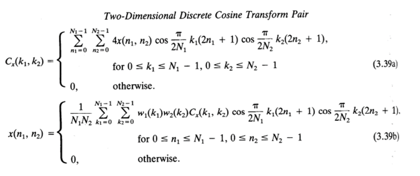
* DFT vs DCT:
  * 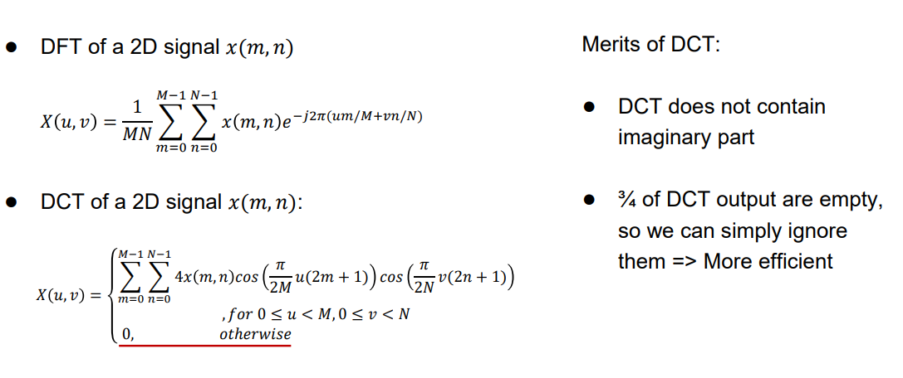
  * 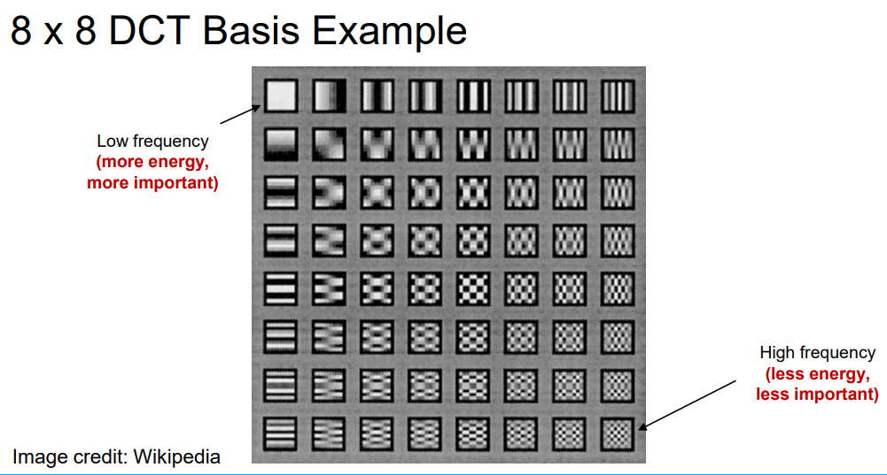
* Results:
  * 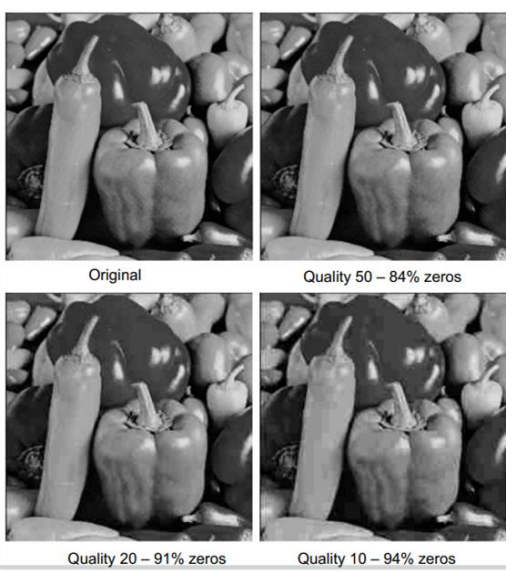
  * Frequency space:
    * 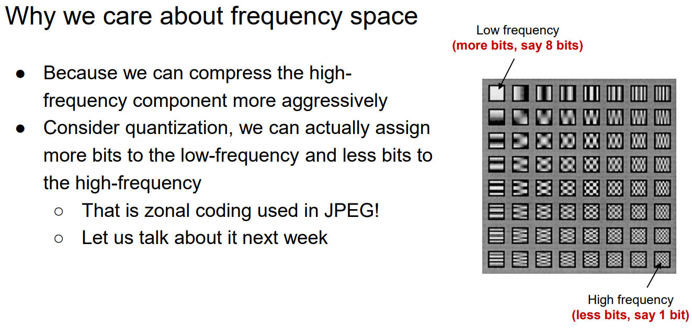
    * We can safely quantize and/or discard the high-freq components.
* Components:
  * Shape: 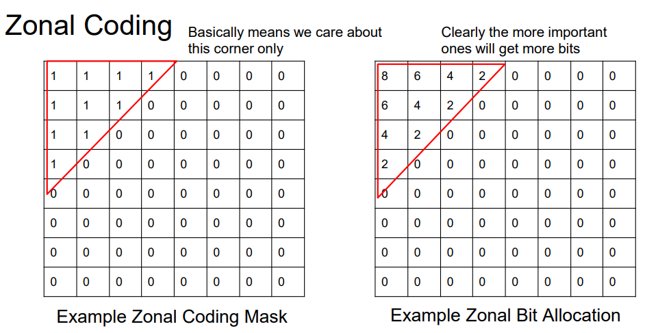
  * Quantization
    * Divided by quantization table $Q$ (take nearest integer).
  * Zig-Zag RLE
    * 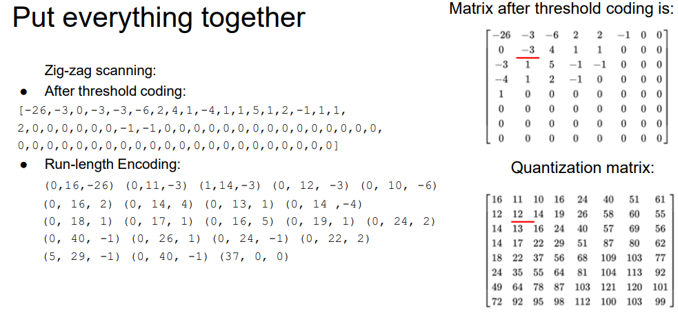

#### Discrete Cosine Transform (DCT) - Proof

In DCT, we aim to solve the previous problem with DFT over the image, where:
1. Discontinuities along the edges causes abnormally high high-frequency components.
2. Complex-valued outputs which require double space to store
3. Symmetric output which is inefficient

For (1), instead of using $x(n)$ directly, we apply the transform over a symmetric and periodic $y(n)$, where

$$
y(n)=\begin{cases}
  x(n),&n\in[0,N-1]\\
  x(2N-1-n),&n\in[N,2N-1]
\end{cases}
$$

After that, we do regular DFT over $y(n)$, obtaining:

$$
\begin{align*}
Y(k) &= \sum_{n=0}^{2N-1}{y(n)\exp{\left(2\pi ik\frac{n}{2N}\right)}}\\
& = \left(
  \sum_{n=0}^{N-1}{y(n)\exp{\left(2\pi ik\frac{n}{2N}\right)}}
  +\sum_{n=N}^{2N-1}{y(n)\exp{\left(2\pi ik\frac{n}{2N}\right)}}
\right)\\
& = \left(
  \sum_{n=0}^{N-1}{x(n)\exp{\left(\pi ik\frac{n}{N}\right)}}
  +\sum_{n=0}^{N-1}{x(n)\exp{\left(\pi ik\frac{2N-1-n}{N}\right)}}
\right)\\
& = \left(
  \sum_{n=0}^{N-1}{x(n)\left(
    \exp{\left(\pi ik\frac{n}{N}\right)}+\exp{\left(\pi ik\left(2-\frac{n}{N}-\frac1N\right)\right)}
  \right)}
\right)\\
& = \exp{\left(-\frac{\pi ik}{2N}\right)}\left(
  \sum_{n=0}^{N-1}{x(n)\left(
    \exp{\left(\pi ik\left(\frac{n}{N}+\frac1{2N}\right)\right)}+\exp{\left(\pi ik\left(-\frac{n}{N}-\frac1{2N}\right)\right)}
  \right)}
\right)
\end{align*}
$$

Given that $\cos(\theta)=\frac{e^{i\theta}+e^{-i\theta}}{2}$, we have:

$$
\begin{align*}
Y(k) 
& = \exp{\left(-\frac{\pi ik}{2N}\right)}\left(
  \sum_{n=0}^{N-1}{2x(n)\cos
    {\frac{\pi}{2N}k(2n+1)}
  }
\right)
\end{align*}
$$

It can be observed that for any $k$, $Y(k)$ must lie on the axis in the direction of $W_{2N}^{-k/2}=\exp{\left(-\frac{\pi ik}{2N}\right)}$. Hence, we can reduce to the DCT coefficients and address problem (2):

$$
\begin{align*}
C(k) 
& = \sum_{n=0}^{N-1}{2x(n)\cos
  {\frac{\pi}{2N}k(2n+1)}
}
\end{align*}
$$

with the range $k\in[0,N-1]$, since it can be observed that $C(-k)=C(k)$. This way, we addressed the problem (3).
<!-- 
#### Inverse Change

It can be observed that $C(k)=W_{2N}^{-k/2}Y(k)$. Then, $x(k)$ -->

## Application

* JPEG: DCT
  * 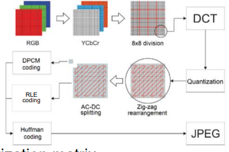
  * DCT is applied to blocks of pixels.
  * Low bit rate causes poor quantization.
  * Nearby blocks quantizes differently -> discontinuities at block boundaries.