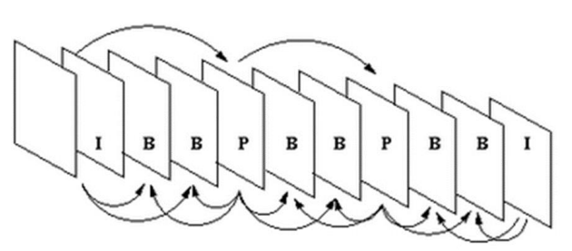
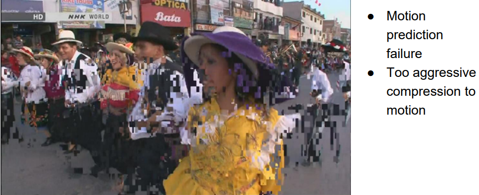
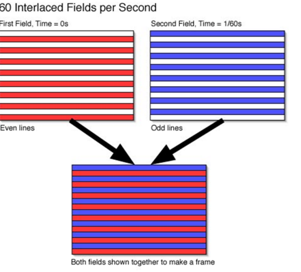

# Video Encoding

* Redundancy:
  * Intra-frame redundancy (the first frame is encoded as still-image)
  * Second-frame onwards, 
    * Redundancy as image
    * Redundancy with previous frames (interframe redundancy)
      * **Motion Estimation**
        * Motion vector (low res)
        * Residual map (low magnitude, aggressive quantization)

## MPEG-1

* I-frame (Keyframe) -> JPEG encoding
  * Random access
* P-frame (Interframe) 
  * -> Forward-predicted frame from closest P or I-frame.
  * Stores only differences between pictures
  * Much better compression 
  * No random access
* B-frame (Bi-directional)
  * Best compression
  * Need to decode next I- or P- frame before B-frame.
* 
* Reduce quality of B-frames, I and P- high quality.

### Artifacts
* Macro-blocking Artifacts
  * 
* Interlacing

## MPEG-2

* Interlacing
* Fields: odd/even lines of a frame
* Effectively doubles the frame-rate without additional frames by interlacing the showing of odd/even lines.
  * 1080i (interlacing scan)
  * 1080p (progressive scan)
* 

## MPEG-4

* Different Video Objects (VO) are encoded and decoded individually
* May use different encoding methods as they serve different purposes
