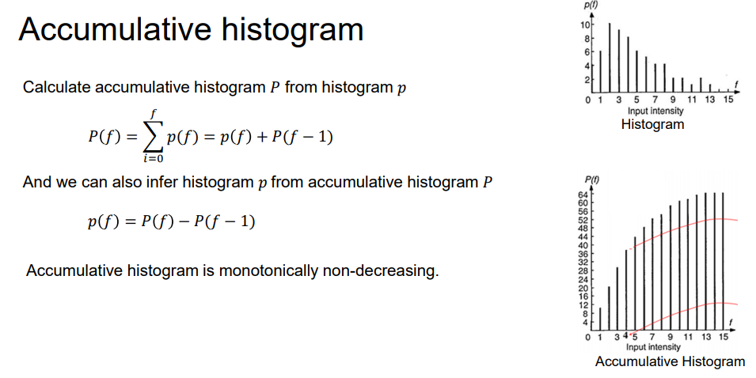

# Image Operations

## Point Operations

$I_o=f_{\text{point op}}(I_i)$

* Gain: $I_o=a\cdot I_i$
  * $a<1$ -> darken
  * $a>1$ -> brighter (clipping)
  * Drawback:   
    * No output value falls into a specific range if darken
    * Details of region is lost if brighten
* Inversion: $I_o=1-I_i$
* Power function / Gamma correction: $I_o=I_i^\gamma$
  * $\gamma=1$: identity
  * $\gamma>1$: darken
  * $\gamma<1$: brighten
* Histogram Modification:
  * 
  * 
  * Find a match so that $P(f)$ is closest to $P_d(g)$ as possible (where $P$ is the cumulative).

## Spatial Transformation

$I_o=f_{\text{filter}}(I_i^\text{window})$

* eg box filter

## Transformation

* Geometric transformation to an image
* Eg rotation, translation
  * Method: for $I_\text{out}$ being a transformation $T$ over input $I_\text{in}$, we can use the inverse transform on the variables:
  * $I_\text{out}(x,y)=I_\text{in}(T^{-1}(x,y))$

