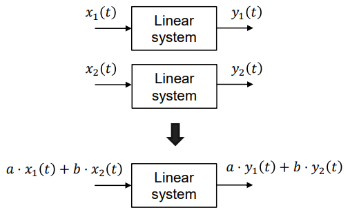
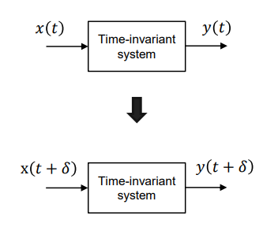
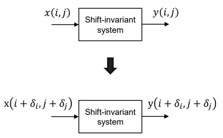
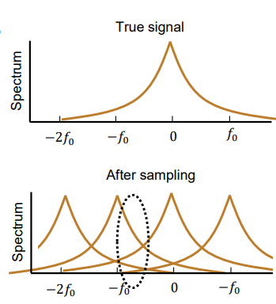

# Invariance

## Linear Time Invariance (LTI)

* Linear:
  * 
* Time Invariance:
  * 
* Space-shift invariance:
  * 
  * eg gaussian blur
  * $y[n]=x*h=\sum_{m=-\infty}^\infty{x[m]h[n-m]}$
  * Continuous ver: $y(t)=(2\pi)^{-1}\int_{-\infty}^{+\infty}{x(\delta)h(t-\delta)d\delta}$

## Linear and Bicubic Interpolation

### Nearest Neighbour

* Nearest Neighbour

### Simple Case
Assume $I$ is a discrete function that takes in $x\in\mathbb{Z}$, then, the linear interpolation is given by:

$\text{LERP}(I,x)=(1-\delta) I(\lfloor x\rfloor)+\delta I(\lfloor x \rfloor+1)$, 

where $\delta=x-\lfloor x\rfloor$.

### Image
Consider now image $I$ with size $W\times H$, then, $I(x+u,y+v)$ for integer $x,y$ and $u,v\in[0,1)$, we have the interpolation:

$\text{LERP}(I,x+u,y+v)=(1-v)\text{LERP}(I,x+u,y)+v\text{LERP}(I,x+u,y+1)$

### Application

## Downsampling
### SubSampling

* 2x subsample
* (0,0) is always sampled
* Problem: 
  * Noise high-res input
  * Noisy pixels are combined
* Box filter + subsampling (non-overlapping 3x3 pixels)

## Aliasing

* Subsampling: Artifacts appear from high-freq contents.
* Temporal: Sub-sampling
* Effects of subsampling:
  * Original signal repeats multiple times.
  * High-frequency and lowfrequency overlayed
  * 

