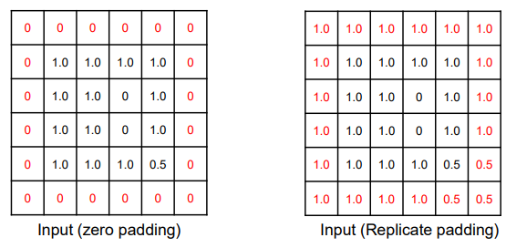
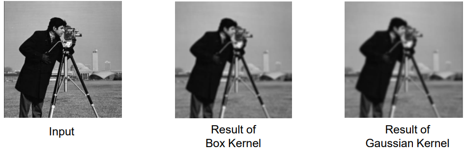
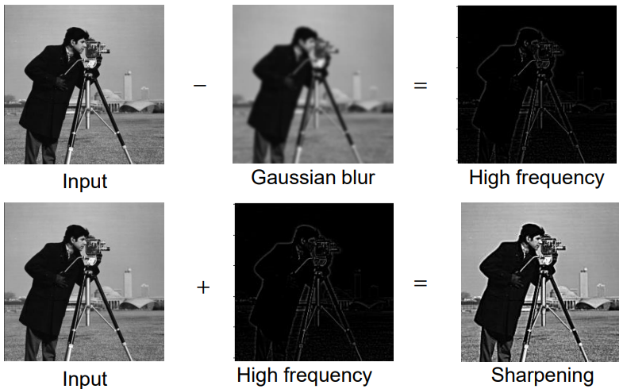
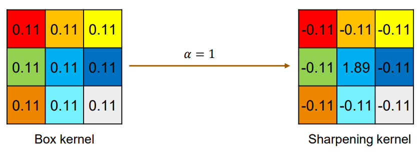
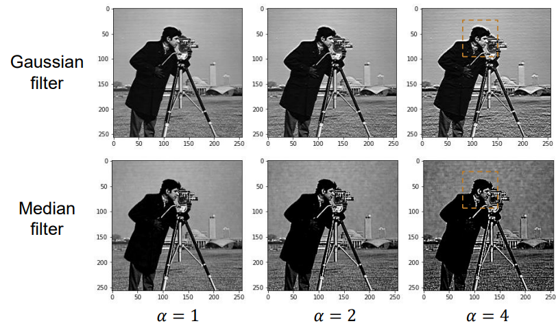
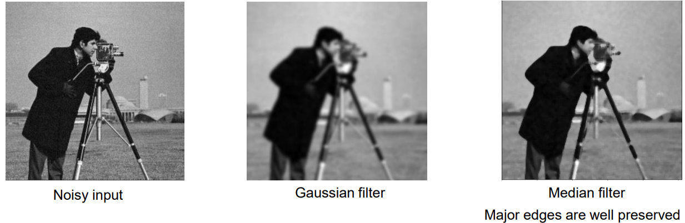

# Spatial Filters

## Padding

* To keep the same size of output after filtering.
  * Zero padding
  * Replicate padding
  * 

## Examples

* Identity filter 
  * $F_\text{id,3}=\begin{bmatrix}0&0&0\\0&1&0\\0&0&0\end{bmatrix}$
  * $(F_\text{id})_{i,j}=\delta(i,j)=\begin{cases}1,&i=j=0\\0,&\text{otherwise}\end{cases}$
* Shift filter
  * Example: $F=\begin{bmatrix}0&0&0\\1&0&0\\0&0&0\end{bmatrix}$
  * Shifts input to the right.

## Average Filters
* Characteristic: Low-pass filters
  * Removes high-frequency components
* Any filters that sums to 1, eg 
  * $\begin{bmatrix}0&0&0\\1/3&1/3&1/3\\0&0&0\end{bmatrix}$
### Box Filter
* Box filter of size $n$.
* Problems:
  * Non-isotropic (orientation-dependent)
    * Creates unnatural, stepped patterns in the output image.
    * 
  * Sharp boundary

### Gaussian Filter
* $k(x,y)=A\cdot\exp{\left(-\frac{x^2+y^2}{2\sigma^2}\right)}$
* $A$ chosen to make the kernel sums to 1.
* Normally truncated at around $2\sigma$ radius.

## Sharpening Filters

* Increase high-frequency components
  * Non-trivial
  * 
* Image sharpening can be performed by inverting the blurring process:
  * $I_\text{sharpen}=I+\alpha(1-F_\text{blur}(I))$
* Hence, sharpening kernel can be given by: 
  * $F_\text{sharpen}=((1+\alpha)F_\text{identity}-\alpha F_\text{blur})$
  * Pre-computing this kernel allow one-pass application over the image (more efficient)
  * 
* Problem:
  * Introduces halo artifacts.
* Median Filter:
  * No halo artifacts
  * 

## Edge Detection

* Laplacian Filter:
  * Edge Detection
  * $L(x,y)=\frac{\partial^2 I}{\partial x^2}+\frac{\partial^2 I}{\partial y^2}$
  * Variants:
    * $\begin{bmatrix}0&1&0\\1&-3&1\\0&1&0\end{bmatrix}$
    * $\begin{bmatrix}0&-1&0\\-1&4&-1\\0&-1&0\end{bmatrix}$

## Noise Removal

* Blur Kernels
  * Problem:
    * Also blur the boundary while sharpening the other parts.
* Median filter
* 