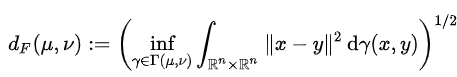
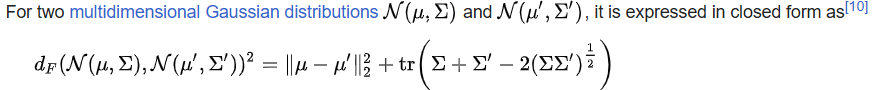

# Metrics

## Mean Square Error (MSE)
* $\text{MSE}(I_\text{filtered},I_\text{clean})=\frac1N\sum{\lVert I_f(x)-I_c(x)\rVert^2}$
* Average MSE: $\text{MSE}=\frac1M\sum_i{\text{MSE}(I^{(i)}_f,I^{(i)}_c)}$
* Find optimal kernel by RMSE:
  * $\min_K\sum_i{\text{MSE}(I^{(i)}_n*K,I^{(i)}_c)}$

## Peak Signal-to-Noise Ratio (PSNR)
* Units in $dB$, defined as:
  * $PSNR=10\cdot \log_{10}\left(\frac{\text{MAX}_I^2}{\text{MSE}}\right)$
* where $\text{MAX}_I$ is the maximum possible pixel value of the image ($2^B-1$ for $B$ bits).

## Multi-Scale Structural Similarity Measure (MS-SSIM)
### SSIM
$$
\begin{align*}
SSIM(x,y)=[l(x,y)]^\alpha\cdot [c(x,y)]^\beta\cdot [s(x,y)]^\gamma
\end{align*}
$$
with 
* Mean brightness estimation $l(x,y)=\frac{2\mu_x\mu_y+C_1}{\mu_x^2+\mu_y^2+C_1}$
  * Using mean to estimate the mean brightness
* Mean contrast estimation $c(x,y)=\frac{2\sigma_x\sigma_y+C_2}{\sigma_x^2+\sigma_y^2+C_2}$
  * Using the variance to estimate the contrast
* Structural Similarity $s(x,y)=\frac{\sigma_{xy}+C_3}{\sigma_x\sigma_y+C_3}$
  * Using the covariance to estimate the structural similarity.
* where, $C_1=(K_1 L)^2, C_2=(K_2 L)^2, C_3=C_2/2$
  * with default $K_1=0.01, K_2=0.03$ and $L=2^B-1$ with $B$ being the bit depth.
  * with default $\alpha=\beta=\gamma=1$.

Properties of SSIM:
* Symmetric: $SSIM(x,y)=SSIM(y,x)$
* Bounded: $SSIM(x,y)\leq 1$
* $SSIM(x,y)=1$ iff $x=y$.

Problems:
* Only works for images for specific settings and resolutions.

### MS-SSIM
* Compute SSIM on different scale (only compute contrast $c_j(x,y)$ and structural similarity $s_j(x,y)$ for each scale $j$, with $\alpha_j=\beta_j=\gamma_j$).
* Accounts for the human perception of "similarity".

## Fréchet inception distance (FID)
* For 2 probability distributions $\mu,\nu$ over $\mathbb{R}^n$ having finite means and variances, the FID or **earth-mover distance** is given by:
  * 
* Assume Gaussian inputs:
  * 