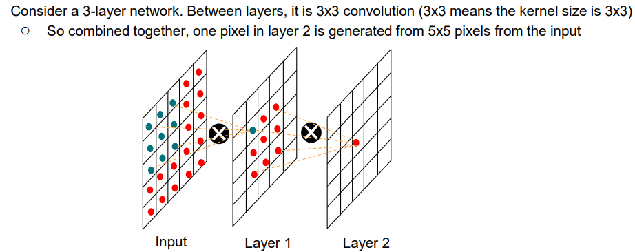

# Computer Vision

## Evaluation Metrics

* MSE:
  * $\text{MSE}(I_\text{filtered},I_\text{clean})=\frac1N\sum{\lVert I_f(x)-I_c(x)\rVert^2}$
  * Average MSE: $\text{MSE}=\frac1M\sum_i{\text{MSE}(I^{(i)}_f,I^{(i)}_c)}$
  * Find optimal kernel by RMSE:
    * $\min_K\sum_i{\text{MSE}(I^{(i)}_n*K,I^{(i)}_c)}$

## Gradient Descent

## Networks

* Linear Regression
* Stacking Layers
  * Non-linear layers are necessary else the problem degrade to linear.
* ReLU

## Conv
* Convolution
  * 
  * Idea: Weight Sharing

### Receptive Field
* Size of region that produces the pixel at the output
* 
* Problem: 
  * Receptive Field for Conv-only network (no pooling) is small (For 16-layer in VGG, receptive field is 33x33 -> utilizes only 2% of pixels).

### Pooling (Stride-2)
* Examples
  * AlexNet
  * VGG
  * Inception
* Receptive Field:
  * 
  * Doubles for pooling layer.
  * Exponential increasing of receptive field.
  * 

### Others
* ResNet, U-Net
  * Skip Connection

## Image Denoising

* U-Net
  * 
  * Join skip connection to prevent losing resolution.
  * Contraction, Expansion phases, skip connection

### Approaches
* Discriminative Model
  * $P(Y|X=x)$ models the conditional probability of target $Y$, given an observation $x$.
* Generative Model
  * Models the joint probability distribution $P(X,Y)$ given observable variable $X$ and target variable $Y$.
  * Auto-Encoder:
    * 
  * Diffusion
    * 
  * GAN
    * 
    * Problems:
      * Mode collapse
      * Non-convergence (oscillation in parameters)
      * Diminished gradients
      * Overfitting (unbalance between generator and discriminator)
    * Later Works:
      * StyleGAN, BigGAN: Conditioning
    * GAN inversion: Find $E(I)=z$ for $G(z)=I$.

### Auto-Encoder
* Problems for auto-encoder:
  * **Feature Space** often contains empty space
* VAE: 
  * models the latent representation as $\mu$ and $\sigma$.
  * 

### Diffusion Model
* Idea: Denoising from absolute noise
* Problem: Single-step denoising cannot generate high-quality output
* Intuition: Step-by-step denoising
* Backward denoising
  * 
* Problem:
  * Predicting a less noisy version is not stable
* Solution:
  * Directly predict the clean image at each step
  * Precisely, the noise prediction network predicts the noise $\epsilon_\theta$.
  * 
* Procedures:
  * Sampling and Training:
    * 
  * Backward process:
    * 

#### DDPM

#### Stable Diffusion

* Diffusion + VAE
* 

### Generative Adversarial Network

* 

### Control Net

* Conditioning
  * Add conditioning to the decoder part
  * Source of conditioning: External pre-trained model (reuse encoder)
    * 
    * Zero-convolution: Zero-initialize layers so that the convolution layers replaced DO NOT AFFECT the original capabilities of the model.

## Others
* RNN, LSTM
* Transformer
* Reinforcement Learning
  * AlphaGo, DeepSeek

## Tasks

* Denoising
* Super-resolution
* Genreative models